# Kafe Koffee Knight

A complete mobile application for cafes that allows customers to browse menu items, place orders, and make payments — all from their device. It also includes admin tools for tracking orders and updating the menu. Designed for small cafes looking to streamline ordering and enhance the customer experience.

### 🚀 Features

### 🧑‍🍳 For Customers:
- Browse and search food & drink items
- Select quantity and add extras (e.g., toppings, sides) before ordering
- Add items to cart and place orders
- Make secure payments
- Track order status
- View personal profile with order history
- Explore the cafe's gallery and learn about its story (About page)
- Post and read public reviews (like a social feed)

### 👨‍💼 For Admin:
- View and manage all customer orders (e.g., mark items as delivered)
- Add, update, or remove menu items and extras
- Monitor user reviews and feedback
## 🛠️ Tech Stack

- React Native
- MongoDB
- Tailwind CSS (Nativewind)
- Nodejs
- Expressjs
- Expo

##Screenshots

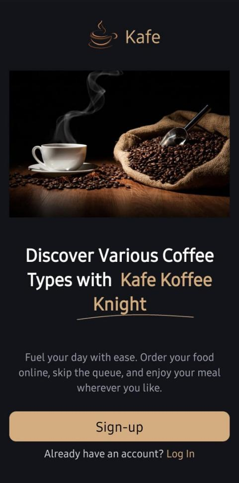
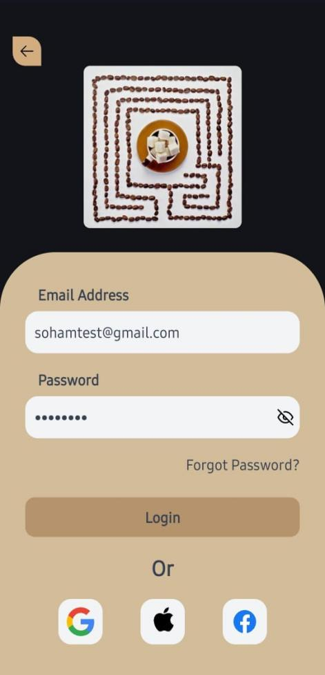

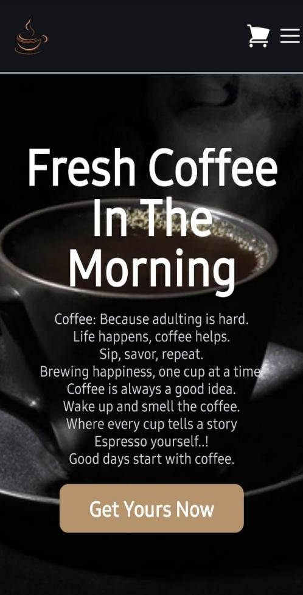
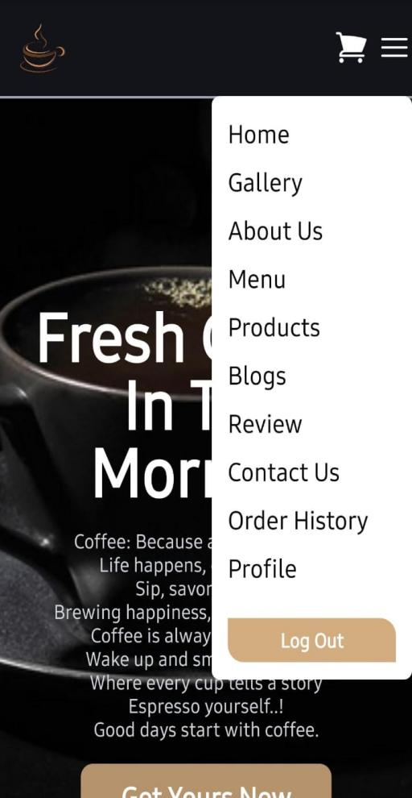
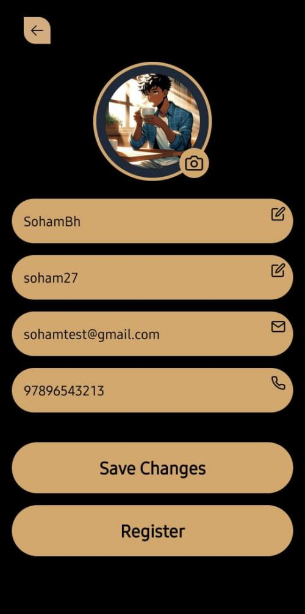
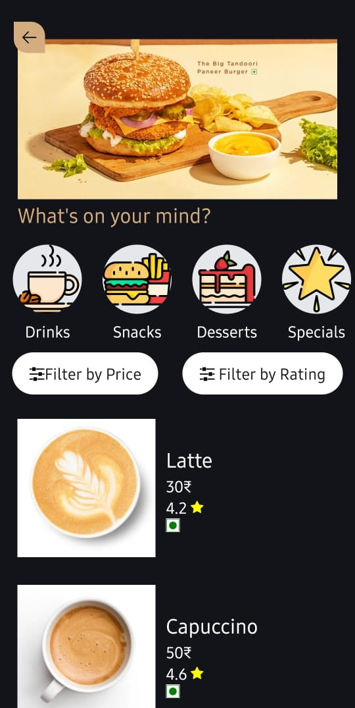
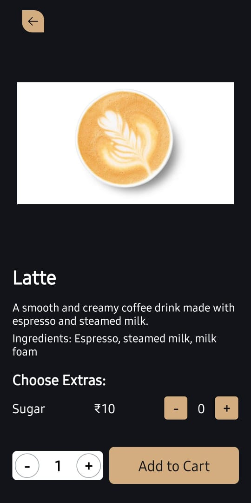
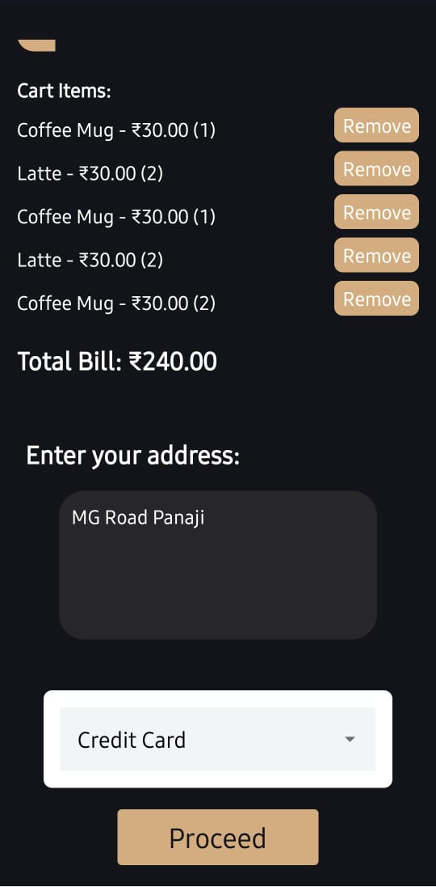
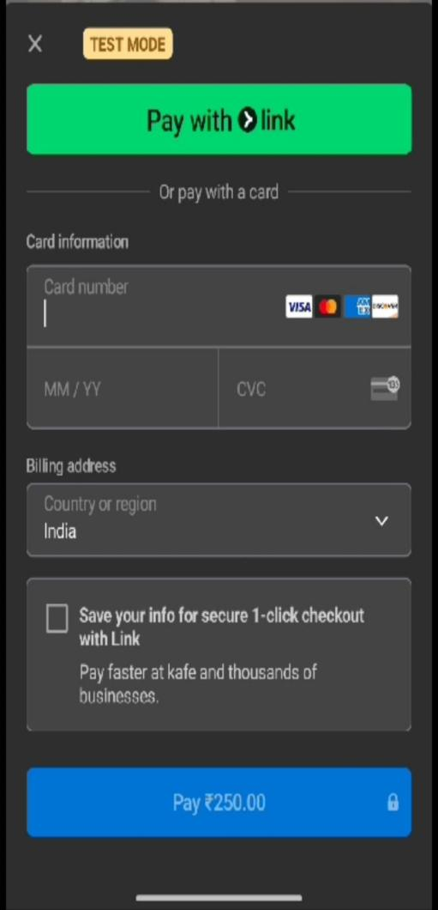
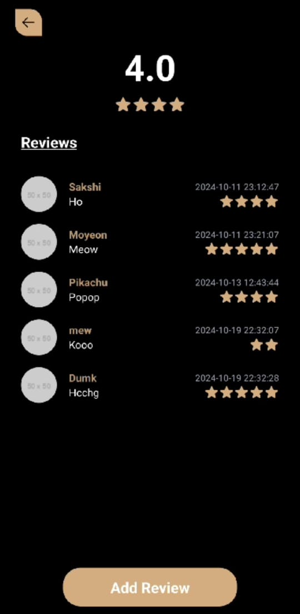
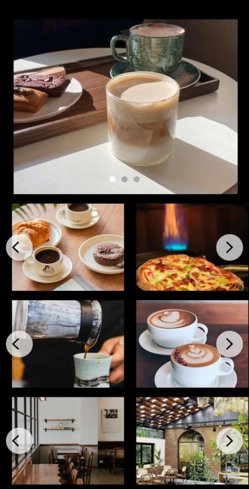
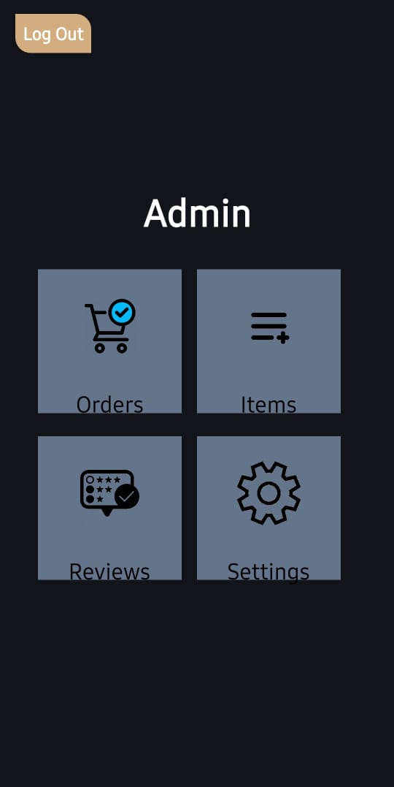
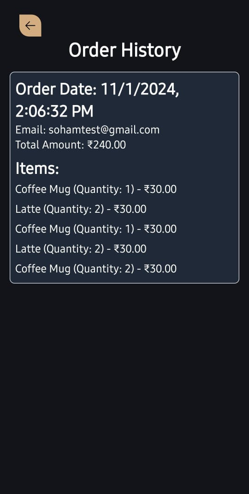
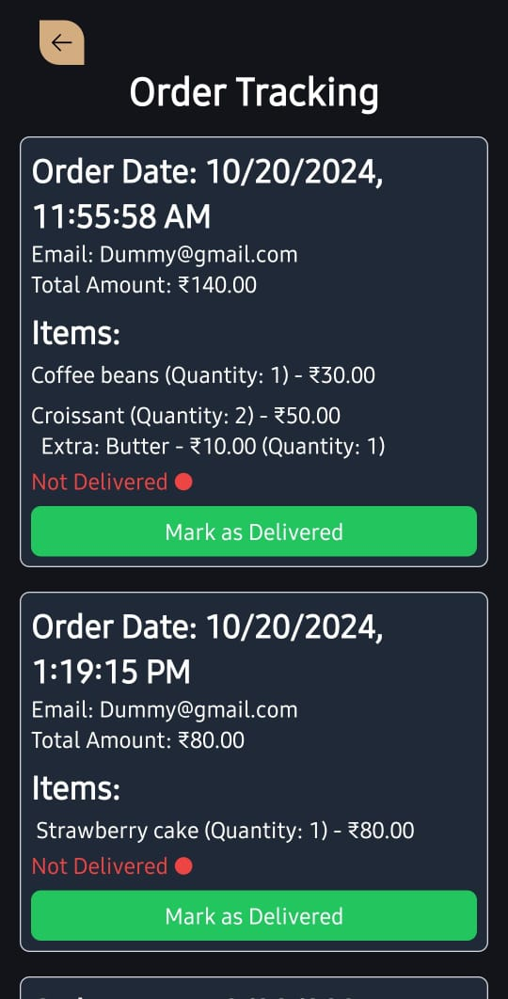
